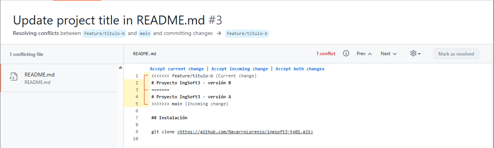
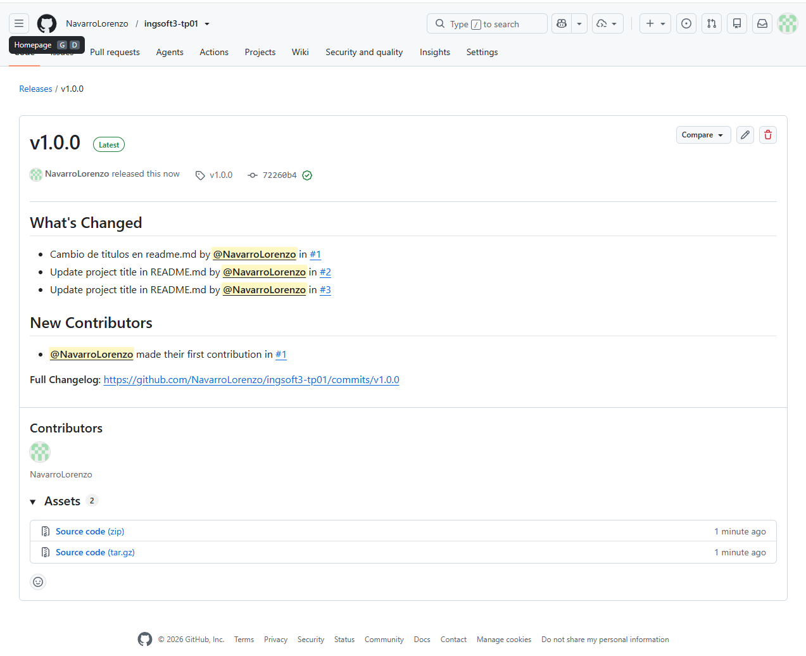
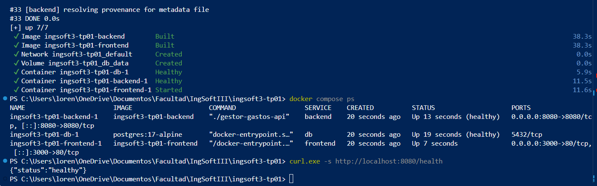
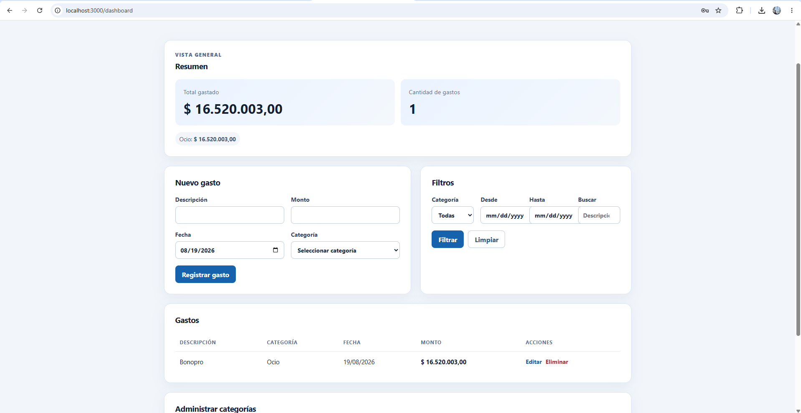
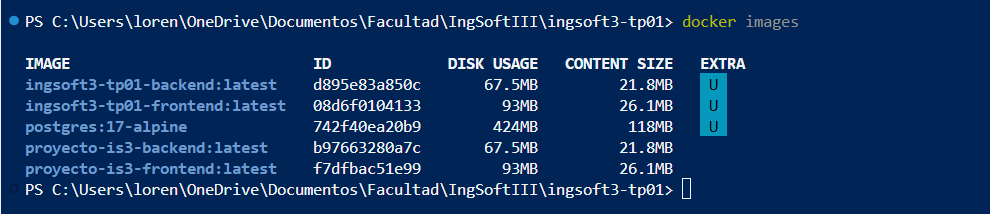
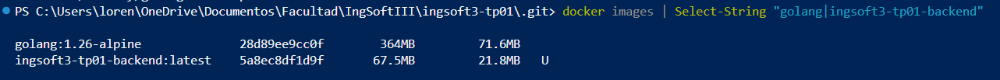

# Evidencias

## TP1 — Git y flujo de trabajo

### 1. Push directo a main rechazado

Se intentó realizar un push directamente sobre la rama `main`. GitHub rechazó el cambio porque la rama se encuentra protegida y está configurada para que los cambios ingresen únicamente mediante Pull Requests. La protección también se aplica al administrador del repositorio.

### 2. Conflicto de merge en el Pull Request

Al intentar integrar la rama `feature/titulo-b` con `main`, GitHub detectó que los cambios no podían fusionarse automáticamente. Esto ocurrió porque ambas ramas habían modificado de manera diferente la misma línea del archivo `README.md`.

### 3. Marcadores del conflicto

Al abrir la resolución del conflicto, GitHub mostró los marcadores `<<<<<<<`, `=======` y `>>>>>>>`, indicando las dos versiones en conflicto. La rama `feature/titulo-b` contenía "versión B", mientras que `main` ya contenía "versión A". Fue necesario decidir manualmente qué contenido conservar antes de completar el merge.

### 4. Release v1.0.0 publicada

Se publicó la primera versión estable del trabajo utilizando el tag `v1.0.0`, siguiendo versionado semántico. La release contiene los cambios realizados mediante Pull Requests, incluyendo la resolución del conflicto de merge.

## TP2 — Contenedores

### 1. Servicios levantados y healthchecks

Se construyó y levantó el sistema completo utilizando Docker Compose. En la salida de `docker compose ps` se observa que PostgreSQL y el backend se encuentran en estado `healthy`, mientras que el frontend está ejecutándose correctamente.

También se verificó el endpoint `/health` del backend mediante `curl`, obteniendo como respuesta `{"status":"healthy"}`.

### 2. Aplicación funcionando end-to-end

Se accedió a la aplicación desde `localhost:3000` y se verificó el funcionamiento completo del sistema. El frontend servido por Nginx se comunica con el backend desarrollado en Go y este, a su vez, con PostgreSQL.

Como prueba se registró un gasto y se comprobó que apareciera correctamente tanto en el listado como en el resumen de gastos.

### 3. Imágenes Docker generadas

Mediante el comando `docker images` se verificaron las imágenes utilizadas y generadas para ejecutar el sistema. Entre ellas se encuentran la imagen del backend, la imagen del frontend y la imagen oficial de PostgreSQL utilizada por la base de datos.

Esta salida permite comprobar que Docker construyó correctamente las imágenes propias del frontend y backend a partir de sus respectivos Dockerfiles.

### 4. Comparación entre imagen de SDK e imagen final

Se comparó la imagen `golang:1.26-alpine`, utilizada durante la etapa de compilación del backend, con la imagen final `ingsoft3-tp01-backend`.

La imagen de Go utilizada para el build tiene un tamaño aproximado de **71,6 MB**, mientras que la imagen final del backend ocupa aproximadamente **21,8 MB**.

Esta diferencia demuestra el beneficio del Dockerfile multi-stage: las herramientas utilizadas para compilar el proyecto permanecen en la etapa de build y la imagen final contiene solamente lo necesario para ejecutar la aplicación.

# TP3 — Planificación y trazabilidad

## Duración del sprint

Elegí que el sprint tenga una duración de **2 semanas**. Me pareció un tiempo razonable porque permite organizar las tareas sin hacer un sprint demasiado largo, pero tampoco tan corto como para tener que estar reorganizando constantemente el trabajo. Además, es una duración bastante común y se adapta bien al tiempo que tenemos entre las entregas de la materia.

## Límite de trabajo en progreso

Configuré un límite de trabajo en progreso de **2 tareas** en la columna `In Progress`.

Elegí este número porque estoy trabajando solo en el proyecto y usé la regla de cantidad de personas + 1. Esto me permite trabajar principalmente en una tarea y, si esa queda bloqueada o esperando algo, poder avanzar con una segunda sin empezar demasiadas cosas al mismo tiempo.

## Historia mal escrita

La historia *"Como desarrollador quiero crear la tabla usuarios para guardar los datos"* está mal escrita porque en realidad describe una tarea técnica y no algo que entregue valor directamente a un usuario.

La reescribiría como: *"Como usuario quiero poder registrarme para guardar mis datos y acceder a mi cuenta."* De esta forma se describe primero lo que necesita el usuario y después la creación de la tabla podría ser una tarea técnica necesaria para cumplir esa historia.

## Problemas encontrados

Uno de los problemas que tuve fue que creé el GitHub Project mediante comandos y los issues no se agregaban automáticamente al proyecto. Para solucionarlo entré a los workflows del Project, activé `Auto-add to project` y seleccioné el repositorio del trabajo.

También tuve que cambiar la visibilidad del Project porque inicialmente estaba privado. Lo hice desde la terminal con `gh project edit` y después comprobé que quedara público.

Por último, comprobé la trazabilidad creando el PR que implementaba la tarea de crear el workflow de CI. En la descripción puse `Closes #8` y, después de hacer el merge a `main`, GitHub cerró automáticamente la tarea y la movió a `Done`. La historia quedó en `1/2`, ya que la segunda tarea todavía sigue pendiente.

## Uso de inteligencia artificial

Utilicé inteligencia artificial como ayuda para interpretar algunos puntos de la guía, preparar los comandos de GitHub CLI y revisar que la configuración que iba haciendo cumpliera con lo pedido.

No tomé los resultados directamente como correctos, sino que fui ejecutando cada paso y comprobándolo en GitHub. También comparé lo realizado con los checkpoints y requisitos de la guía del profesor para verificar que la jerarquía, el sprint, el tablero, el límite de trabajo en progreso y la trazabilidad funcionaran correctamente.
