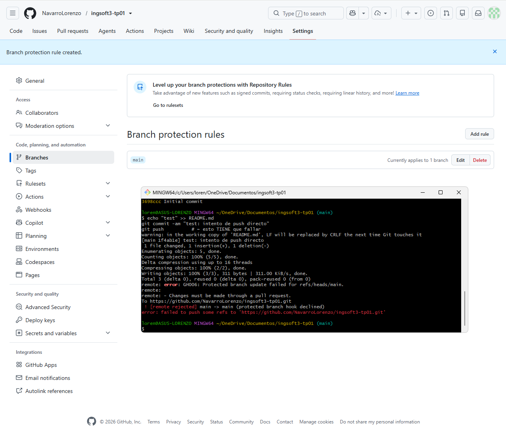
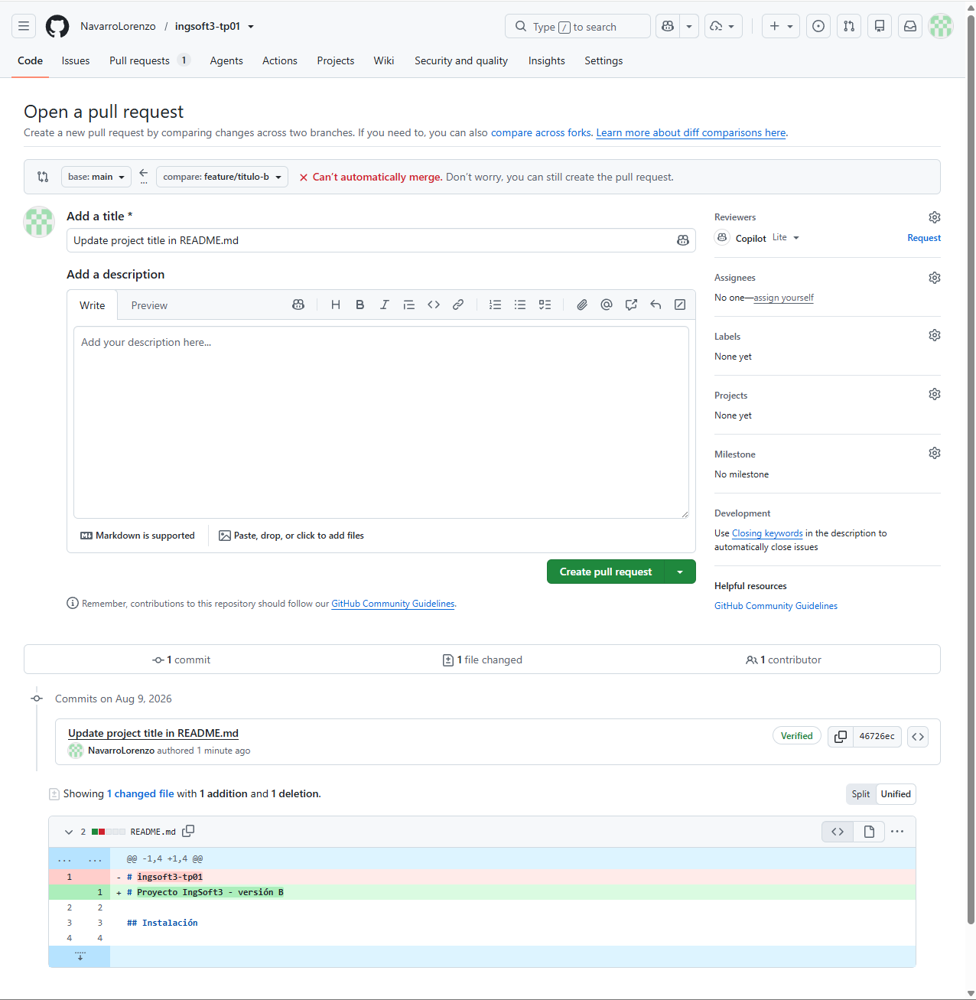

# Evidencias — TP1

## 1. Push directo a main rechazado

Se intentó realizar un push directamente sobre la rama `main`. GitHub rechazó el cambio porque la rama se encuentra protegida y está configurada para que los cambios ingresen únicamente mediante Pull Requests. La protección también se aplica al administrador del repositorio.

## 2. Conflicto de merge en el Pull Request

Al intentar integrar la rama `feature/titulo-b` con `main`, GitHub detectó que los cambios no podían fusionarse automáticamente. Esto ocurrió porque ambas ramas habían modificado de manera diferente la misma línea del archivo `README.md`.

## 3. Marcadores del conflicto

Al abrir la resolución del conflicto, GitHub mostró los marcadores `<<<<<<<`, `=======` y `>>>>>>>`, indicando las dos versiones en conflicto. La rama `feature/titulo-b` contenía "versión B", mientras que `main` ya contenía "versión A". Fue necesario decidir manualmente qué contenido conservar antes de completar el merge.

## 4. Release v1.0.0 publicada

Se publicó la primera versión estable del trabajo utilizando el tag `v1.0.0`, siguiendo versionado semántico. La release contiene los cambios realizados mediante Pull Requests, incluyendo la resolución del conflicto de merge.
